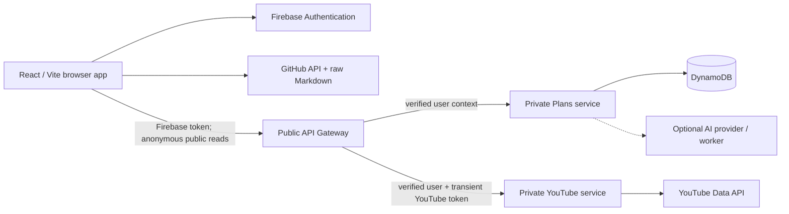

# YouTube Learning Workspace — System Design Showcase

This documentation set presents the YouTube Learning Workspace as a system-design interview proof of concept and as an engineering case study.

The product turns unstructured learning sources into a navigable hierarchy:

```text
Learning plan → Course → Module → Video
                         ↘ progress, labels, bookmarks, playback

GitHub repository → Year → Topic → Nested folders → Markdown note
```

It supports private learning workflows, anonymous read-only publication, GitHub-backed notes, YouTube source discovery, AI-assisted organization, responsive course playback, and offline-tolerant progress tracking.

## How to use this documentation

| Document | Best for | Key question |
| --- | --- | --- |
| [12 — Functional requirements](12_functional-requirements.md) | Product and interview scope | What must the system do? |
| [13 — Non-functional requirements](13_non-functional-requirements.md) | Scale, reliability, security | How well must it work? |
| [14 — High-level design](14_high-level-design.md) | Architecture discussion | What are the major components and boundaries? |
| [15 — Low-level design](15_low-level-design.md) | Deep technical discussion | How do data, APIs, state, and workflows operate? |
| [16 — Engineering decisions and tradeoffs](16_engineering-challenges-and-tradeoffs.md) | Developer case study | What was difficult, what was chosen, and why? |
| [17 — Future improvements](17_future-improvements.md) | Evolution and scale | What should be built next? |
| [18 — Interview and demo guide](18_interview-and-demo-guide.md) | Presentation preparation | How can this be explained clearly in 10–30 minutes? |

Existing feature-specific records remain useful supporting material:

- [Firebase integration](02_firebase-integration.md)
- [Microservice boundaries](04_microservices.md)
- [Source Feed Inbox](06_source_feed_inbox.md)
- [Persistent AI job queue](07_persistentAI_job_queue.md)
- [Mobile-first UI](08_Mobile-first-ui.md)
- [AWS migration](09_aws-migration.md)
- [Public read mode](10_read_mode.md)

## System-design framing

The POC began as a personal learning organizer, so its present workload is intentionally small. The design discussion nevertheless explores a plausible path from a single-user tool to a multi-user platform.

Numbers labelled **design target** are proposed service objectives, not production measurements. Scenarios labelled **illustrative** are storytelling devices based on behavior the system supports; they are not claims about real customers or incidents.

## One-minute architecture summary



The central architectural decisions are:

1. The browser calls one gateway, while domain services remain private.
2. Firebase proves identity; the server derives the user ID rather than trusting client input.
3. Public learning plans use a dedicated allow-listed projection, not the private aggregate.
4. GitHub notes are fetched directly by the UI because the configured repositories are public and read-only.
5. Redux is the active UI cache; IndexedDB retains authenticated plan snapshots and pending progress for offline reading.
6. Offline progress is coalesced by video and sent as one bulk update instead of replaying every UI event.
7. DynamoDB decomposes the learning hierarchy to avoid the 400 KB item limit and enable bounded mutations.
8. Expensive AI work is modelled as durable jobs when synchronous request/response is no longer sufficient.

## Scope honesty

This is a feature-rich POC, not a claim of internet-scale production maturity. It has strong architectural seams—gateway routing, repository abstractions, safe projections, serverless infrastructure, and durable-job contracts—but still needs load testing, full observability, stronger concurrency control, and automated end-to-end coverage before serving a large audience.

