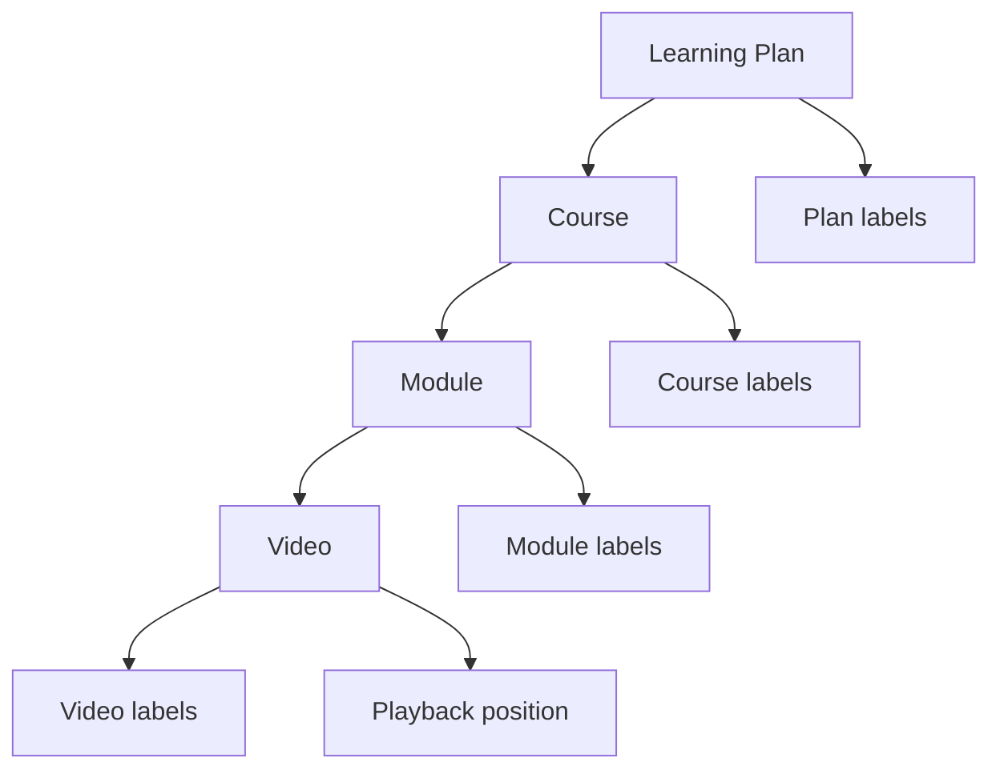

# Functional Requirements

## 1. Product goal

The system helps a learner transform scattered YouTube content and engineering notes into structured, searchable learning experiences. Private users can organize and track progress; anonymous readers can browse explicitly published material without receiving private workflow state.

## 2. Actors

| Actor | Authentication | Main capabilities |
| --- | --- | --- |
| Anonymous reader | None | Browse public plans, open public courses, play videos, read public GitHub notes |
| Authenticated learner | Firebase sign-in | Create and manage plans, organize courses, track progress, bookmark content, publish plans |
| Connected YouTube user | Firebase plus short-lived Google token | Discover channels, playlists, videos, and new source feeds |
| AI-assisted learner | Authenticated plus configured model | Request course generation or feed organization and review results |
| Operator/developer | Cloud/IaC access | Deploy services, configure secrets, inspect logs, and manage environments |

## 3. Core domain hierarchy

A learning plan is the aggregate users recognize, while course, module, and video IDs provide stable navigation and mutation targets.

## 4. Functional requirements by capability

### FR-1 — Identity and session

- A user can sign in with the Firebase Google provider and sign out.
- Protected API calls include the current Firebase ID token.
- The gateway verifies the token and derives the user identity.
- Private data is isolated by the verified user ID.
- Public plan and GitHub note reads do not require sign-in.
- An expired or unavailable authenticated session must not erase an already cached private plan from the browser.

### FR-2 — Learning-plan lifecycle

- Create a plan with name, description, and optional visual identity.
- List the signed-in user's plans.
- Open a specific plan and its courses.
- Edit plan metadata.
- Delete a plan after explicit confirmation.
- Refresh a cached plan from the backend.
- Replace a complete plan when reconciling an approved local copy.
- Calculate aggregate progress from eligible videos in all courses.

### FR-3 — Course and curriculum management

- Add a course manually.
- Add a course using AI-assisted organization.
- Edit or delete courses.
- Organize videos into ordered modules.
- Reorder a video within a course or move videos across courses/modules.
- Search and filter course/module/video content.
- Expand or collapse module trees.
- Navigate to previous and next videos.

### FR-4 — Learning workspace

- Play the selected YouTube video in a responsive frame.
- Keep the active video synchronized with the module tree.
- Restore the last selected video and playback position.
- Mark videos watched or bookmarked.
- Expose course, module, and video bookmarks through a navigational drawer.
- Display a compact desktop workspace and a mobile-first outline drawer.
- Support touch navigation and mobile landscape playback behavior where the browser permits it.

### FR-5 — Progress and offline behavior

- Update watched state and playback position locally without waiting for the network.
- Cache private plans per authenticated user in IndexedDB.
- Indicate whether the view is synchronized, offline, or awaiting authentication.
- Coalesce repeated changes to the same video into one pending record.
- When connectivity and authentication return, ask the user before bulk-syncing pending progress.
- Apply the bulk response to Redux and clear only successfully synchronized pending changes.
- Avoid progress API calls while the client knows the API is unavailable.

### FR-6 — Public learning plans

- A plan owner can publish and unpublish a plan.
- Publication creates a stable share identifier.
- Anonymous users can browse public plan summaries with offset pagination and a default page size of 20.
- Anonymous users can open the full read-only curriculum and video workspace.
- The public representation excludes playback, watched state, bookmarks, deletion flags, refresh flags, private source configuration, and internal IDs not required for navigation.
- Public clients cannot call mutations through the public route namespace.

### FR-7 — GitHub learning notes

- The UI reads configured public repositories without a backend dependency.
- Only Markdown files below the configured documentation root are indexed.
- Files whose base name ends in `__x` are ignored.
- Directory segments are interpreted as year/range, topic, subtopic, and nested folders.
- Year ranges such as `2021-2025` remain intact.
- The reader provides repository, year, topic, module, file-tree, breadcrumb, previous/next, and heading navigation.
- Markdown supports headings, tables, code, links, Mermaid diagrams, and approved embedded content.
- Internal file links open within the learning navigation flow.
- Internal folder links open a master/detail preview: nested structure first, selected file content second.
- Preview history supports Back rather than stacking an unbounded set of drawers.
- External resources use provider-aware icons and preview only when embedding is permitted; otherwise they open directly in a new tab.
- Local development can switch an available configured repository between GitHub and a local checkout; the production UI hides unavailable local controls.

### FR-8 — YouTube source discovery

- Obtain a short-lived YouTube access token through a user gesture.
- List subscribed channels, playlists, and video metadata.
- Keep the YouTube token in browser memory and pass it transiently.
- Never persist that access token in Redux, local storage, or the application database.

### FR-9 — Source Feed Inbox

- Persist source-to-course targets and per-source synchronization checkpoints.
- Pull new feeds globally or for a selected channel.
- Use a count-aware full reconciliation when necessary and incremental activity reads otherwise.
- Deduplicate discovered videos by `video_id` across existing curriculum and pending feeds.
- Search, filter, sort, and preview pending videos.
- Push selected videos manually to an existing/new course and existing/new module.
- Ask AI for a reviewable placement proposal, allow feedback/rethink, and require explicit confirmation before applying it.
- Clear only successfully placed inbox entries.

### FR-10 — AI configuration and durable requests

- Configure supported AI providers and models without exposing secrets in public state.
- Validate capacity settings such as batch size and model context limits.
- Test a configuration before using it.
- Submit course-generation requests in batch or whole-input mode.
- Inspect request status and details.
- Retry or cancel eligible requests.
- Record attempts, rate-limit waits, failures, and generated course IDs.
- Use deterministic or JSON fallback behavior where configured when the model path is unavailable.

### FR-11 — Personalization and accessibility

- Support System, Light, and Dark appearance modes.
- Support pale, balanced, and vibrant color intensity.
- Support standard and high contrast.
- Support selectable accent and global font size.
- Persist appearance choices on the device and react to OS theme changes in System mode.
- Preserve semantic buttons, labels, keyboard focus, reduced-motion preference, and mobile safe areas.

## 5. Primary user journeys

### Journey A — Build a learning path

1. Sign in.
2. Create a plan called “Distributed Systems Interview.”
3. Add a course manually or select YouTube sources for AI organization.
4. Review modules and reorder misplaced videos.
5. Enter the course workspace and begin watching.

### Journey B — Resume during an outage

1. Open a previously loaded private course while the backend is unavailable.
2. Read the cached outline and continue navigating.
3. Mark two videos watched; Redux and IndexedDB retain the coalesced changes.
4. Connectivity returns and the UI indicates pending progress.
5. Confirm a bulk sync; the backend merges progress and returns the current plan.

### Journey C — Share without leaking private state

1. Publish a private plan.
2. Send its share URL to a reader who is not signed in.
3. The reader browses courses and plays videos.
4. The response contains curriculum metadata but no playback position, bookmarks, watched labels, source inbox, or owner UID.

### Journey D — Read connected notes

1. Open Learning Notes without signing in.
2. Select a repository, year, and topic.
3. Search the tree and open a Markdown note containing Mermaid and internal links.
4. Preview a linked folder, choose a file in its nested master tree, then jump into the normal navigation flow.

## 6. Out of scope for the current POC

- Multi-author collaborative editing.
- Paid subscriptions, licensing, or content hosting.
- Uploading or transcoding video.
- Guaranteed background YouTube synchronization after the browser closes.
- Social comments, reactions, and follower graphs.
- Formal classroom assessment, certificates, or grading.
- Full-text server-side indexing of every remote note.
- Conflict-free multi-device editing of the full learning-plan aggregate.

