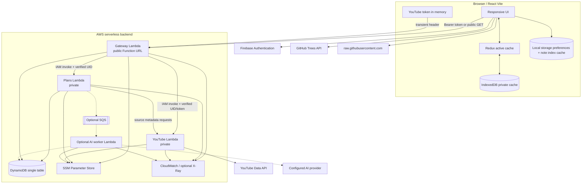
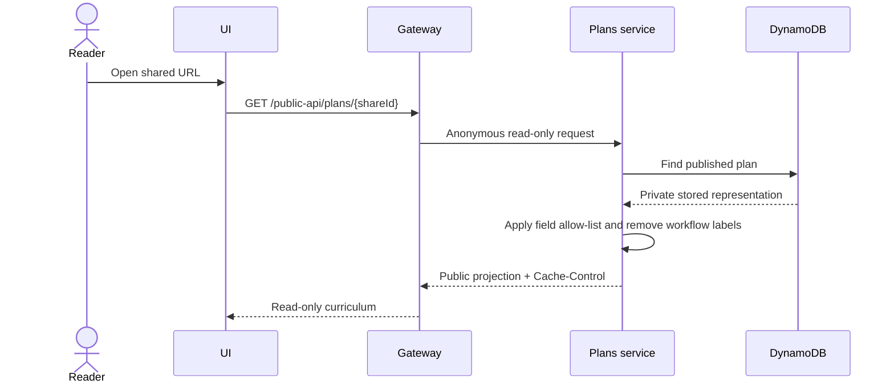
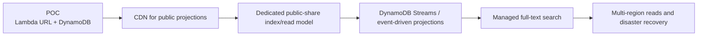

# High-Level Design

## 1. Design strategy

The architecture separates four concerns:

1. **Experience:** React renders private learning, public curriculum, and GitHub notes.
2. **Trust boundary:** one public gateway authenticates, rate-limits, and routes requests.
3. **Domain ownership:** Plans owns curriculum/progress; YouTube owns provider catalog access.
4. **Persistence and asynchronous work:** DynamoDB stores decomposed domain records; a durable worker path handles expensive AI work when enabled.

The design is deliberately hybrid. Public Markdown stays at GitHub and is fetched client-side. Private application data goes through the gateway. This avoids paying for a backend proxy that adds no authorization or transformation value to public notes.

## 2. Component diagram



## 3. Request routing

| Path family | Authentication | Owner |
| --- | --- | --- |
| `/public-api/plans*` GET/HEAD | Anonymous allowed | Plans service |
| `/api/channels` | Firebase + transient YouTube token | YouTube service |
| `/api/videos` | Firebase + transient YouTube token | YouTube service |
| `/api/{channel}/playlists` | Firebase + transient YouTube token | YouTube service |
| Other `/api/*` | Firebase | Plans service |

The gateway rejects non-read methods under `/public-api/`. For protected routes, middleware verifies Firebase and stores the UID in request context. In Lambda mode, the gateway invokes private functions with a trusted event containing the verified `user_id`.

## 4. Major data flows

### 4.1 Private plan read with offline fallback

```mermaid
sequenceDiagram
    actor Learner
    participant UI as React UI
    participant IDB as IndexedDB
    participant Redux
    participant GW as Gateway
    participant Plans as Plans service
    participant DB as DynamoDB

    Learner->>UI: Sign in / open plans
    UI->>IDB: Load cache for Firebase UID
    IDB-->>UI: Cached plans + pending progress
    UI->>Redux: Hydrate immediately
    UI->>GW: GET /api/plans
    alt API available
        GW->>Plans: Verified UID + request
        Plans->>DB: Query user partition
        DB-->>Plans: Plan records
        Plans-->>UI: Current plans
        UI->>Redux: Replace server snapshot + apply pending progress
        UI->>IDB: Persist merged view
    else Offline / expired session
        UI-->>Learner: Keep cached plan visible; show status indicator
    end
```

### 4.2 Offline progress synchronization

```mermaid
sequenceDiagram
    actor Learner
    participant UI
    participant Redux
    participant IDB as IndexedDB
    participant API as Plans API

    Learner->>UI: Watch/mark video while offline
    UI->>Redux: Apply progress immediately
    UI->>Redux: Upsert pending change by video ID
    Redux->>IDB: Persist plan + pending map
    Note over Redux,IDB: Repeated events for one video are coalesced
    UI-->>Learner: Show offline/pending indicator
    Learner->>UI: Confirm Sync now after reconnect
    UI->>API: PATCH /api/plans/{id}/progress
    API-->>UI: Merged plan + conflict signal
    UI->>Redux: Replace plan; clear pending changes
    UI->>IDB: Save synchronized snapshot
```

### 4.3 Anonymous publication



### 4.4 GitHub notes

```mermaid
sequenceDiagram
    actor Reader
    participant UI
    participant Cache as Browser cache
    participant GH as GitHub Trees API
    participant Raw as Raw GitHub

    Reader->>UI: Select repository
    UI->>Cache: Check repository index (5-minute TTL)
    alt Index missing or stale
        UI->>GH: GET recursive branch tree
        GH-->>UI: Paths and blobs
        UI->>UI: Keep docs/*.md; exclude *__x.md
        UI->>Cache: Store normalized index
    end
    Reader->>UI: Select note
    UI->>Raw: GET Markdown body
    Raw-->>UI: Markdown
    UI->>UI: Render headings, links, Mermaid, approved embeds
```

## 5. Deployment topology

The target serverless topology keeps the static Vite UI on Render and deploys three container-image Lambdas:

- Gateway: the only public function URL.
- Plans: private; owns DynamoDB application data.
- YouTube: private; calls YouTube Data API.

Terraform provisions ECR, Lambda functions, IAM roles, DynamoDB, log groups, SSM access, rate-limit permissions, and the gateway URL/CORS policy. Local development can run the same FastAPI applications over HTTP with SQLite-backed repositories.

## 6. Why these boundaries?

### Gateway vs direct public services

One public gateway centralizes token verification, CORS, throttling, and route policy. Private functions have no public URL, reducing their attack surface. The tradeoff is an extra hop and more gateway responsibility.

### Plans vs YouTube

Plans manages a stable product domain; YouTube is a volatile external integration with quota and token concerns. Separating them allows independent testing, scaling, and replacement. The tradeoff is service-to-service latency during source synchronization.

### Direct GitHub notes

The notes are already public and read-only. Browser-to-GitHub access removes backend cost and availability coupling. The tradeoffs are GitHub rate limits, CORS/external availability, no server-side full-text index, and public-only support.

### DynamoDB vs relational storage

DynamoDB fits serverless, user-partitioned access and low idle cost. Decomposed hierarchy records avoid the item-size ceiling. The tradeoffs are explicit access-pattern design, denormalized projections, and harder ad-hoc queries.

## 7. Failure isolation

| Failure | User impact | Containment |
| --- | --- | --- |
| GitHub unavailable | Notes index/content may fail | Plans and course learning remain available |
| YouTube API quota exhausted | New source discovery fails | Existing plans and stored metadata remain usable |
| AI provider throttled | Generation waits/falls back | Manual organization remains available |
| Plans API unavailable | Private writes stop | Cached private plans remain readable; progress queues locally |
| Firebase session expires | Protected calls stop | Public content remains available; cached plan is not erased |
| One private Lambda fails | Routed domain unavailable | Gateway returns a bounded 503; other domain can remain healthy |

## 8. Scaling evolution



The important interview point is that the POC does not prematurely deploy every scale component. It establishes boundaries that allow those components to be introduced when measurements justify them.

