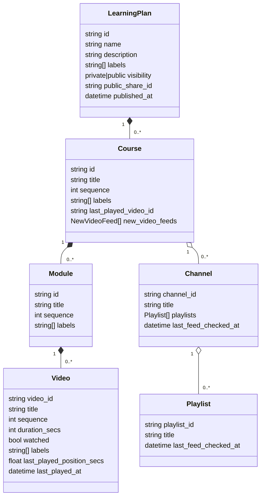
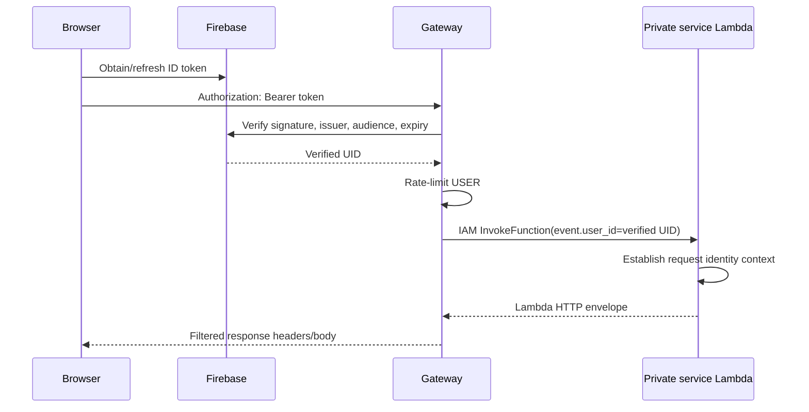
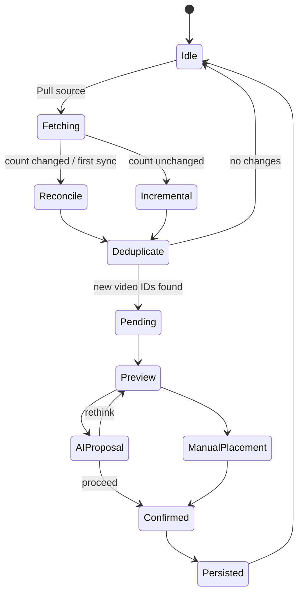
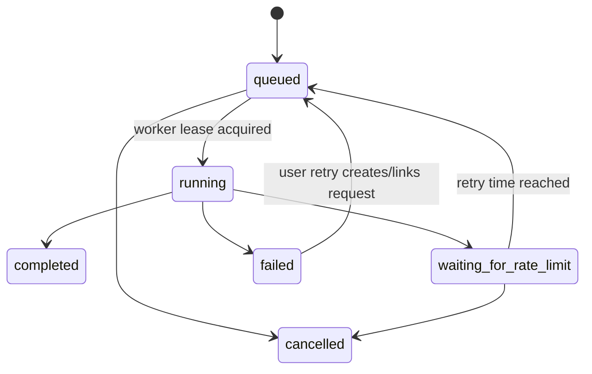

# Low-Level Design

## 1. Code organization

```text
youtube_agent_2/
├── frontend/
│   └── src/
│       ├── api/                 # HTTP and GitHub clients
│       ├── components/          # Drawers, plan detail, shared controls
│       ├── config/              # Public note repository configuration
│       ├── pages/               # Route-level views
│       ├── store/               # Redux slices
│       ├── utils/               # Progress and IndexedDB helpers
│       ├── App.jsx              # Shell, routes, auth/session orchestration
│       └── App.css              # Responsive/theme system
├── backend/
│   ├── shared/
│   │   ├── contracts/           # Transport-only shared types
│   │   └── platform/            # Identity, Firebase, settings, runtime
│   └── services/
│       ├── gateway/app/         # Auth, routing, throttling, proxy/invoke
│       ├── plans/app/           # Curriculum, progress, sync, AI jobs
│       └── youtube/app/         # YouTube catalog adapter
└── deployment/
    ├── infra_1_aws/             # Terraform and Lambda containers
    ├── infra_2_minikube/        # Kubernetes/Helm local platform option
    └── infra_3_render/          # Alternate service blueprint
```

Dependency rule: `service → shared`; one service does not import another service's application code. Cross-domain communication uses HTTP locally or trusted Lambda invocation in AWS.

## 2. Domain model



IDs are UUIDs for application-owned entities and YouTube IDs for videos/channels/playlists. Sequence fields define stable display order independently of storage order.

## 3. DynamoDB access model

The production repository stores a logical aggregate as multiple physical items.

| PK | SK | Purpose |
| --- | --- | --- |
| `USER#{uid}` | `PLAN#{planId}` | Plan metadata and publication state |
| `USER#{uid}` | `PLAN#{planId}#COURSE#{courseId}` | Course metadata and source references |
| `USER#{uid}` | `PLAN#{planId}#COURSE#{courseId}#MODULE#{moduleId}` | Module metadata |
| `USER#{uid}` | `PLAN#{planId}#COURSE#{courseId}#MODULE#{moduleId}#VIDEO#{videoId}` | Video metadata and progress |
| `USER#{uid}` | `SYNC#CHANNEL#{channelId}` | Channel checkpoint/targets |
| `USER#{uid}` | `SYNC#CHANNEL#{channelId}#PLAYLIST#{playlistId}` | Playlist checkpoint/targets |
| `USER#{uid}` | `SYNC#...#NEW#{videoId}` | Pending source video |
| `RATE#{identity}` | `MINUTE#{epochMinute}` | Atomic gateway request counter with TTL |

### Main access patterns

| Operation | Persistence behavior |
| --- | --- |
| List user plans | Query `PK=USER#{uid}`, select plan roots, reconstruct required summaries |
| Get one plan | Query the plan sort-key prefix and assemble courses/modules/videos |
| Update one video | Address its deterministic child key; avoid rewriting unrelated videos |
| Delete plan | Query plan prefix, delete child records in batches |
| Load sync inbox | Query `SYNC#` prefix |
| Rate limit | Conditional atomic counter increment; reject at configured limit |

### Known limitations

- Publication lookup needs an efficient share-ID access path as the catalog grows. A scan-based or owner-dependent lookup is acceptable only at POC scale.
- A complete-plan reconstruction can become expensive for plans containing many thousands of videos.
- Structural updates use last-write-wins unless a transaction/version check is explicitly applied.
- A single user partition can become hot for an unusually active account.

## 4. API design

### Plans and publication

| Method | Route | Behavior |
| --- | --- | --- |
| POST | `/api/plans` | Create private plan |
| GET | `/api/plans` | List current user's plans |
| GET | `/api/plans/{planId}` | Load plan detail |
| PATCH | `/api/plans/{planId}` | Update plan metadata |
| PUT | `/api/plans/{planId}` | Replace approved full plan snapshot |
| DELETE | `/api/plans/{planId}` | Delete plan |
| POST | `/api/plans/{planId}/publication` | Publish and create/reuse share ID |
| DELETE | `/api/plans/{planId}/publication` | Revoke anonymous publication |
| GET | `/public-api/plans?limit=&offset=` | Paginated anonymous summaries |
| GET | `/public-api/plans/{shareId}` | Anonymous safe detail projection |

### Curriculum and progress

| Method | Route | Behavior |
| --- | --- | --- |
| PATCH | `/api/plans/{planId}/add-course-manually` | Add course |
| DELETE | `/api/courses/{planId}` | Delete selected courses |
| PATCH | `/api/plans/{planId}/courses/{courseId}` | Update course metadata |
| PATCH | `.../labels` | Replace labels at plan/course/module/video scope |
| PATCH | `.../videos/{videoId}/playback` | Save one playback position |
| PATCH | `/api/plans/{planId}/progress` | Bulk merge watched/position changes |
| PATCH | `.../videos/reorder` | Move a video inside course modules |
| PATCH | `/api/plans/{planId}/videos/move` | Bulk move videos across courses/modules |

The backend owns validation through Pydantic. For example, playback position cannot be negative, a bulk progress request contains 1–2,000 changes, and a move request must contain at least one video ID.

## 5. Authentication and gateway internals



For anonymous public reads, the gateway deliberately leaves `user_id` empty, uses a public/IP-derived rate-limit key, and accepts only read methods. CORS limits browser origins but is not treated as authentication.

## 6. Public projection design

The public serializer is an allow-list, not a list of fields to remove.

```text
Stored private plan
    ↓ select PLAN_FIELDS
    ↓ sort and select COURSE_FIELDS
    ↓ sort and select MODULE_FIELDS
    ↓ sort and select VIDEO_FIELDS
    ↓ strip private workflow labels
Public projection
```

Excluded examples:

- plan owner and internal private identifiers;
- `last_played_video_id`, positions, timestamps, and watched state;
- bookmarks, deletion flags, and refresh workflow labels;
- source channels and `new_video_feeds`;
- playlist item internals not required by the reader.

This isolates anonymous contracts from private model growth: adding a sensitive private field does not publish it unless someone also changes the allow-list.

## 7. Frontend state model

| Redux slice | Responsibility |
| --- | --- |
| `plans` | Private plan list, selection, local progress application |
| `privatePlanSync` | Network/auth status, pending changes by plan, sync errors |
| `publicPlans` | Offset pages and detail records cached independently |
| `sources` | Source-sync metadata and inbox state |
| `aiModels` | Model configuration state |
| `learningUi` | Persisted learning-workspace choices |
| `dashboard` | Dashboard view state |

### Public plan cache

Pages are keyed by offset and details by share ID. Async-thunk conditions prevent duplicate loads when a record is already `loading` or `ready`. A forced page refresh can bypass the condition. The API default is 20 summaries per page.

### Private plan cache

IndexedDB uses one record per Firebase UID:

```json
{
  "userId": "firebase-uid",
  "plans": [],
  "pendingByPlan": {},
  "savedAt": "ISO-8601 timestamp"
}
```

User scoping prevents one account's cached plans from being hydrated into another account's session on the same device.

## 8. Offline progress algorithm

Pending changes use a map keyed by plan and video rather than an append-only event log.

```text
pendingByPlan[planId] = {
  baseUpdatedAt,
  videos: {
    [videoId]: {
      courseId,
      moduleId,
      videoId,
      watched?,
      positionSecs?,
      changedAt
    }
  }
}
```

### Write path

1. Apply the progress change to the visible Redux plan immediately.
2. Upsert the change into `pendingByPlan[planId].videos[videoId]`.
3. Preserve fields from an earlier change that the latest event did not replace.
4. Persist plans and pending maps to IndexedDB.
5. Do not issue a remote call while `networkOnline && authAvailable` is false.

### Reconnect path

1. Detect restored network/auth availability.
2. Indicate how many video changes are pending.
3. Ask the learner before synchronization.
4. Send one bounded `BulkProgressUpdateRequest`.
5. The server merges video-level progress and reports whether the plan changed remotely.
6. Replace the Redux plan with the server result and clear the pending map.

### Tradeoff

Coalescing loses the exact event history—such as every seek or watch/unwatch transition—but dramatically reduces writes and makes retry idempotence easier. The product needs final progress state, not an analytics event stream, so this is the correct default.

## 9. GitHub Notes reader internals

### Configuration

Each public repository has:

```js
{
  id,
  owner,
  repo,
  branch,
  path,          // documentation root
  localRepo?,    // optional dev checkout alias
  name,
  description
}
```

No token is allowed because bundled frontend configuration is public.

### Indexing

1. Call GitHub's recursive branch-tree endpoint.
2. Retain blobs under the configured root.
3. Retain `.md` and `.markdown` extensions.
4. Remove files whose base name ends in `__x`, case-insensitively.
5. Derive title, folder, SHA, size, and GitHub URL.
6. Sort paths using numeric-aware comparison.
7. Cache the normalized index in memory and local storage for five minutes.

### Content

Content is fetched only for the selected path. In local development, Vite middleware exposes status/index/content/raw endpoints for explicitly mapped checkouts. The UI reports local vs remote source. Deployed environments do not advertise local mode because the middleware has no matching checkout.

### Link classification

The renderer resolves links relative to the current note and classifies them as:

- internal Markdown file;
- internal directory;
- internal asset;
- YouTube video or post;
- known external provider such as GitHub, ChatGPT, DeepSeek, or ByteByteGo;
- generic external link.

Internal resources stay in the app's preview/navigation flow. External preview is attempted only for supported content; websites that block framing are opened directly to avoid a two-click dead end.

## 10. Source synchronization

Source sync maintains checkpoints and pending videos independently of the course hierarchy.



The 24-hour overlap on incremental windows favors duplicate detection over missed uploads. Stable video IDs make overlap safe.

## 11. Persistent AI requests

The durable model splits a small request record from large immutable details, batches, and append-oriented attempt records.

```text
Request: status, counters, model snapshot, lease, next attempt
Details: selected sources, videos, request options, completion summary
Batch: video IDs, status, result, token estimates, retry state
Attempt: provider/model, outcome, rate-limit metadata, timestamp
```

Important state transitions:



A model snapshot is stored with the request so later configuration edits do not silently change an in-flight job's semantics.

## 12. Responsive layout behavior

- Mobile uses a sticky top application bar and full-height drawers.
- Desktop uses a compact/expanded side navigation.
- The course workspace allocates remaining viewport height between video detail and a wider outline tree.
- Mobile portrait stacks player before the outline; the player preserves 16:9.
- Search and outline actions move into the outline panel on small screens.
- Swipe-revealed row actions are supplemental; keyboard/buttons remain the semantic control model.
- Appearance is token-driven through document attributes, so components do not contain theme branching.

## 13. Error and recovery semantics

| Condition | Client behavior | Server behavior |
| --- | --- | --- |
| `navigator.onLine=false` | Throw typed unavailable error; queue progress | No call |
| Fetch/network failure | Mark API unavailable; keep cache | — |
| Firebase token failure/401 | Mark auth unavailable; retain cache | Reject protected request |
| Upstream Lambda failure | Show bounded error | Gateway returns 503 without internals |
| Rate limit exceeded | Show retry state | Gateway returns 429 and `Retry-After: 60` |
| GitHub tree truncated | Explain repository is too large | — |
| External preview blocked | Open direct new tab | — |
| AI provider throttled | Show waiting state | Persist retry timestamp/attempt |

## 14. Test map

| Layer | Examples |
| --- | --- |
| Domain unit | plan mutations, video moves, source deduplication |
| Security projection | private fields/labels absent from public plan |
| API route | authenticated CRUD, public pagination, bulk progress |
| Repository | DynamoDB decomposition/reconstruction/delete batches |
| Gateway | route ownership, public method restrictions, proxy headers |
| Runtime | Lambda event conversion and identity propagation |
| Frontend unit | reducers, progress coalescing, link resolution |
| Browser integration | IndexedDB hydrate/reconnect, note previews, responsive outline |
| Infrastructure | Terraform validate/plan, least-privilege policy review |

