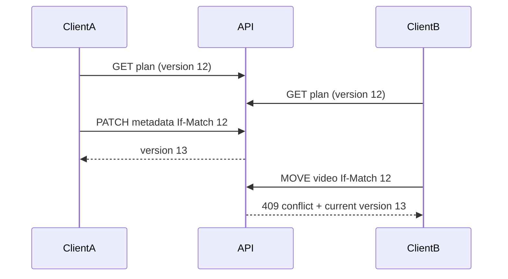
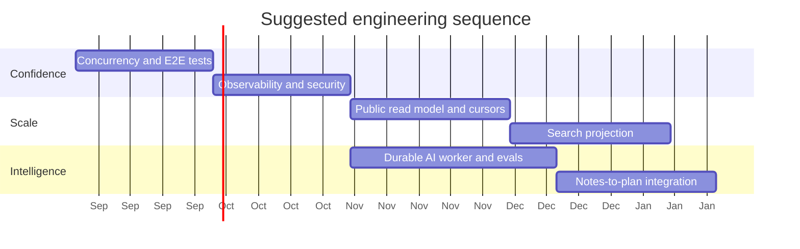

# Future Improvements

The roadmap is ordered by risk reduction and user value rather than novelty. Items marked **Now**, **Next**, and **Later** describe suggested priority, not committed dates.

## 1. Now — production confidence

### 1.1 Optimistic concurrency for structural edits

Add an integer `version` or opaque ETag to each plan/course mutation.



Progress can retain per-video merge semantics, while structural changes should reject stale snapshots. This prevents silent last-write-wins data loss across devices.

### 1.2 Automated end-to-end coverage

Prioritize these browser journeys:

- authenticated create/edit/delete plan;
- publish → anonymous browse → unpublish;
- offline cached course → local progress → reconnect → bulk sync;
- mobile outline drawer, player synchronization, and next/previous;
- GitHub note file/folder links, Mermaid, and blocked external resources;
- two accounts on one browser proving cache isolation.

### 1.3 Observability baseline

- Generate a correlation ID at the edge and propagate it.
- Emit structured JSON logs with redaction.
- Add dashboards for p50/p95/p99 latency, 4xx/5xx, throttles, cold starts, and DynamoDB consumed capacity.
- Add source-sync metrics: videos examined, new, duplicate, accepted, and failed.
- Add AI metrics: queue age, attempts, provider throttles, tokens, cost, and fallback rate.

### 1.4 Security hardening

- Add automated public-projection leak tests for every private model field.
- Add dependency and container scanning.
- Add CSP, strict referrer policy, and iframe sandbox/allow-list tests.
- Validate request body limits at the gateway.
- Review log statements for accidental metadata/token disclosure.
- Rotate SSM secrets and document break-glass procedures.

## 2. Next — scale reads and discovery

### 2.1 Dedicated public-plan read model

Create records keyed directly by share ID:

```text
PK = PUBLIC#{shareId}
SK = SUMMARY | DETAIL | COURSE#{courseId}...
```

Update them synchronously for a simple first version or asynchronously from DynamoDB Streams. Place CloudFront/API Gateway caching ahead of anonymous reads. This protects owner partitions from viral traffic and removes catalog scans.

### 2.2 Cursor pagination

Replace offset pagination when the public catalog grows. Offset is easy for the POC but becomes inefficient and unstable under concurrent publication. Return an opaque cursor based on the public index's evaluated key.

### 2.3 Search service

Introduce a server-side search projection for:

- public plan/course/module/video titles and descriptions;
- authenticated user's private curriculum;
- optionally, configured GitHub note content.

Start with a DynamoDB-backed prefix/index strategy if search requirements are simple. Adopt OpenSearch/Typesense/Meilisearch only when relevance, typo tolerance, and corpus size justify operating it.

### 2.4 GitHub webhook/indexing service

For larger note catalogs, a webhook-driven index can parse changed Markdown, extract headings and links, and update search without recursively listing trees in every browser. Keep direct GitHub mode as a zero-backend fallback.

## 3. Next — stronger offline and sync

### 3.1 Service worker and application shell

Use a PWA service worker to cache static assets, the application shell, and safe public responses. Do not cache Firebase/YouTube tokens. Define explicit cache eviction and version migration.

### 3.2 Background Sync API

Where supported, submit pending progress after reconnect. Preserve an explicit in-app manual sync path because Background Sync is not universal and mobile OS behavior is constrained.

### 3.3 Conflict UI

When `had_remote_changes` is true, explain which fields were merged. For structural conflicts, show local vs remote changes and let the user choose:

- keep remote;
- reapply local operation;
- duplicate as a new plan;
- export local JSON.

### 3.4 Cache schema/version management

Add an IndexedDB schema version, migration functions, size telemetry, “last cached” time, and a user-facing clear-offline-data action.

## 4. Next — AI safety and quality

### 4.1 Complete queue-based worker deployment

- Plans writes an SQS message after creating a request.
- Worker claims idempotently and extends leases for long batches.
- Configure exponential backoff and a dead-letter queue.
- Separate retryable provider failures from validation failures.
- Make confirmation/apply idempotent using a request key.

### 4.2 Evaluation framework

Create labelled examples of good course/module placement. Measure:

- valid structured-output rate;
- percentage of videos placed;
- duplicate/omitted video rate;
- human correction rate;
- module-title quality;
- latency and token cost per 100 videos.

Choose models using quality/cost/latency data rather than intuition.

### 4.3 Retrieval and context control

Provide only relevant plan/course/module summaries to the model. Use deterministic candidate selection before generation. This reduces tokens, prevents unrelated placements, and improves structured-output reliability.

### 4.4 Safety and provenance

- Store prompt/template version and model snapshot.
- Display which placements were AI-generated.
- Require confirmation before structural writes.
- Retain a reversible change set for course organization.

## 5. Later — content and learning intelligence

### 5.1 Learning analytics

- Completion velocity and consistency.
- Estimated remaining study time.
- Course/module drop-off points.
- Resume recommendations based on last activity and prerequisites.

Analytics should use a separate event pipeline rather than overloading the final-state progress store. This is the point where event replay becomes valuable.

### 5.2 Prerequisite graph

Allow modules/courses to declare prerequisites and offer graph-based navigation. Detect cycles and present a topological learning order.

### 5.3 Notes-to-plan integration

- Attach a GitHub note to a course/module/video.
- Generate a study module from a selected note directory.
- Show related notes beside a playing video.
- Search plans and notes from one command palette.

### 5.4 Collaboration

If product scope expands beyond personal use:

- owner/editor/viewer roles;
- invitation and revocation;
- audit trail;
- comments and suggestions;
- fork a public plan into a private editable copy.

This requires a new authorization model; “public vs owner” is not enough.

## 6. Later — platform evolution

### 6.1 API Gateway HTTP API and WAF

Move from a Lambda Function URL when managed route throttling, custom domains, WAF rules, JWT integration, or richer access logs justify the extra cost and configuration.

### 6.2 Multi-region resilience

Only after user/availability requirements demand it:

- replicate public projections globally;
- use Route 53 health-based routing;
- evaluate DynamoDB Global Tables for private data;
- define conflict behavior before enabling multi-region writes.

### 6.3 Event-driven projections

Use DynamoDB Streams/EventBridge to update public views, search, analytics, and notifications. Use an outbox/idempotency strategy so projection failure does not corrupt source-of-truth writes.

### 6.4 Large-plan pagination

Avoid reconstructing every video when opening a plan summary. Split endpoints into:

- plan/course summaries;
- module outline pages;
- video detail/progress batches.

This changes the frontend from aggregate loading to normalized entity loading and should be introduced only when real plan sizes require it.

## 7. Suggested delivery sequence



Dates are illustrative. The dependency order is the important part: establish correctness and visibility before adding scale and intelligence.

## 8. “Not yet” decisions

Avoid adding these without evidence:

- Kubernetes for the small serverless production workload;
- Kafka for progress updates;
- CRDTs for single-owner plans;
- a vector database before a concrete semantic-search/evaluation requirement;
- provisioned Lambda concurrency without cold-start SLO violations;
- multi-region active/active writes without a conflict policy.

Saying “not yet” is part of system design. Every component adds failure modes and operational cost.

