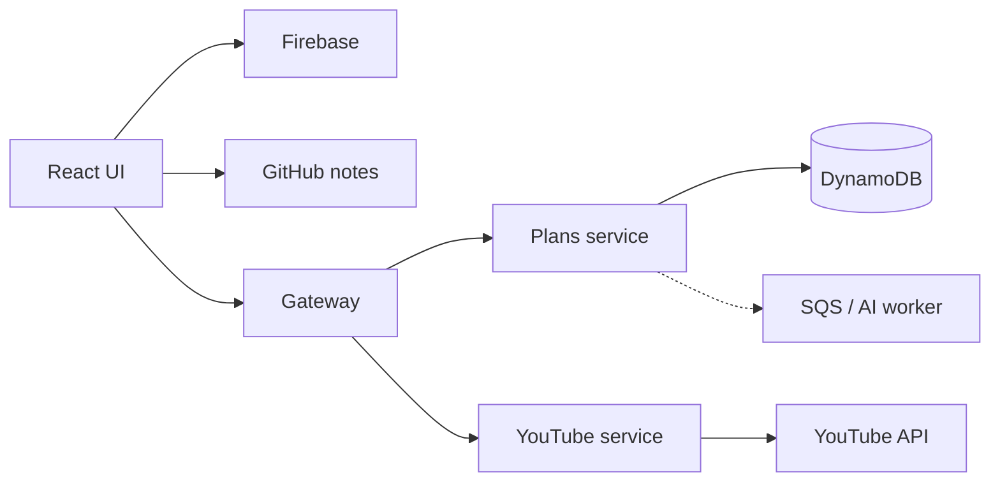

# Interview and Demo Guide

## 1. Opening statement

> I built a learning workspace that turns YouTube sources and public GitHub notes into structured plans, courses, modules, videos, and navigable technical documentation. The interesting design problem is not video playback—it is preserving a coherent private learning state across authentication and outages while also exposing a safe anonymous read model and integrating quota-limited and slow external systems.

This opening establishes the problem, differentiator, and core system-design tension in under 30 seconds.

## 2. Ten-minute presentation

### Minute 0–1 — Problem and scope

- YouTube subscriptions are chronological, not prerequisite-aware.
- Technical notes exist in repositories but are hard to navigate as a learning product.
- The system organizes both while keeping the first version cost-efficient for personal use.
- Private progress and public sharing have different trust requirements.

### Minute 1–2 — Requirements

Name the essential requirements rather than reading a long list:

- plan → course → module → video organization;
- search, bookmarks, playback, and progress;
- source discovery and AI-assisted organization;
- public read-only plans and notes without login;
- offline-tolerant private progress;
- responsive mobile/desktop workspace.

Then state the most important non-functional priorities: privacy, low idle cost, bounded writes, graceful degradation, and an evolution path beyond POC scale.

### Minute 2–4 — High-level architecture

Draw this simplified diagram:

Explain three boundaries:

1. Gateway is the only public backend and establishes identity.
2. Plans and YouTube are separate because state ownership and external-provider risk differ.
3. Public GitHub data bypasses the backend because no authorization or secret is required.

### Minute 4–6 — Deep dive: offline progress

Use the offline progress flow because it combines UX, state, consistency, and API design.

- Redux provides immediate UI state.
- IndexedDB stores per-user plan snapshots and pending changes.
- Changes are coalesced by video, not appended as events.
- Reconnect sends one bulk patch after confirmation.
- The server merges progress instead of replacing structural data.

State the tradeoff: exact event history is sacrificed for idempotence and fewer writes.

### Minute 6–7 — Deep dive: public privacy

- Publication creates a share ID.
- Anonymous routes accept read methods only.
- The Plans service recursively constructs an allow-listed projection.
- Playback, watched/bookmarked state, sources, and workflow flags are absent.
- `Cache-Control` enables short-lived public caching.

State the tradeoff: request-time projections are simple at POC scale; a viral catalog needs a dedicated read model.

### Minute 7–8 — Storage

- A nested JSON plan is convenient but can exceed DynamoDB's 400 KB item limit.
- Store plan/course/module/video as separate items under `USER#{uid}`.
- Query one plan by sort-key prefix and reconstruct it.
- Video progress updates remain bounded.

Mention the weakness: hot users and large aggregate reconstruction. Propose plan/course partitioning and paginated entity APIs when measurements require them.

### Minute 8–9 — External systems and failure

- YouTube token remains in browser memory; safer persistence, but no unattended sync.
- Source sync uses full reconciliation selectively and incremental reads with overlap otherwise.
- AI work moves to a queue/worker when it outgrows HTTP timeouts.
- GitHub and YouTube failures do not prevent cached plan reading.

### Minute 9–10 — Roadmap and close

Prioritize:

1. optimistic concurrency and E2E tests;
2. observability/security baseline;
3. public read model/CDN and cursor pagination;
4. durable AI worker and quality evaluation;
5. unified plan-and-note discovery.

Close with:

> The main design principle is to keep the POC simple where scale is hypothetical, but make trust boundaries, data ownership, and evolution points explicit so scaling does not require rewriting the product.

## 3. Thirty-minute system-design interview structure

| Time | Topic | Evidence to show |
| ---: | --- | --- |
| 0–3 min | Clarify scope and actors | Functional requirements |
| 3–6 min | Workload/SLO assumptions | Non-functional requirements |
| 6–11 min | Main architecture | Component diagram and route table |
| 11–16 min | Data model and APIs | DynamoDB keys and API contracts |
| 16–21 min | Offline consistency | Redux/IndexedDB/bulk merge sequence |
| 21–24 min | Security/public sharing | Gateway identity and allow-list projection |
| 24–27 min | External integrations | YouTube quota, GitHub, AI queue |
| 27–30 min | Bottlenecks and roadmap | Public read model, concurrency, observability |

## 4. Recommended live demo

Prepare data beforehand so the demo does not depend entirely on YouTube/GitHub/API availability.

### Demo path

1. Open the dashboard and show compact/expanded navigation and appearance settings briefly.
2. Open a private plan and point out aggregate progress, compact courses, bookmarks, and actions.
3. Open a course workspace; select a video from the outline and use next/previous navigation.
4. Toggle a watched state and show progress update.
5. Simulate offline mode in browser developer tools; change progress and show the pending/offline indicator.
6. Restore connectivity and explain the confirmation-based bulk sync.
7. Open a public plan in a signed-out/incognito window and emphasize read-only behavior.
8. Open Learning Notes, switch repository/year/topic, render Mermaid, and follow an internal folder link through master/detail preview.

### Backup path

Keep screenshots or a short recording for:

- YouTube consent and source feed discovery;
- AI organization proposal/rethink/confirm;
- offline-to-online transition;
- mobile portrait and landscape layouts.

External OAuth and provider APIs are poor live-demo dependencies.

## 5. Architecture decisions to emphasize

### “Why not one backend?”

For a commercial team at this size, a modular monolith would be reasonable. I separated services to demonstrate and enforce distinct ownership and security boundaries: provider-token/quota behavior in YouTube, durable learning data in Plans, and public policy in Gateway. I preserved local HTTP execution so development remains manageable.

### “Why DynamoDB?”

Traffic is irregular and user-scoped, so on-demand serverless storage keeps idle cost low. Hierarchical keys match known access patterns. I accepted harder ad-hoc queries and aggregate reconstruction. If reporting became primary, I would build projections rather than force DynamoDB into analytics.

### “Why not store the whole plan?”

It risks the 400 KB item limit and turns a one-video progress update into a full-document rewrite. Decomposition bounds write size and conflict scope.

### “Why Redux and IndexedDB?”

Redux is the active session model; IndexedDB survives refresh and supports larger structured snapshots. They solve different lifecycle problems. The backend remains authoritative once connectivity returns.

### “Why user confirmation before sync?”

The learner may have changes on another device. A visible pending state and explicit action avoid surprising writes in the POC. Mature background sync can be opt-in after conflict handling improves.

### “Why no backend for notes?”

Repositories are public and read-only. A proxy would add cost and coupling without adding authorization. The choice changes for private repositories, webhooks, or global full-text search.

### “How do you prevent public leaks?”

Public routes are read-only at the gateway and public payloads are constructed from recursive field allow-lists. New private fields are excluded by default. Projection tests are security tests.

### “What happens when two devices edit?”

Progress merges at video granularity, but structural edits are currently last-write-wins. The next correctness improvement is version/ETag-based optimistic concurrency with a conflict UI.

### “How would you handle a viral public plan?”

Short-term: CDN/cache public responses. Then create a dedicated `PUBLIC#{shareId}` summary/detail read model updated from publication events or DynamoDB Streams. This removes owner-partition pressure and makes lookup constant-time.

### “How would you scale AI?”

Accept work quickly, persist a request and immutable input snapshot, enqueue batches, lease work to idempotent consumers, use exponential retry/DLQ, and record attempts/cost. Require user confirmation before applying structural changes.

## 6. Bottleneck analysis

| Bottleneck | First symptom | First response | Long-term response |
| --- | --- | --- | --- |
| Lambda cold start | High first-request p95 | Trim image/imports, measure | Provision only critical path if justified |
| Large plan reconstruction | Slow detail and large payload | Load summaries first | Paginated normalized entity APIs |
| Public share lookup | Hot/slow anonymous reads | Cache 60s/CDN | Dedicated public read model |
| User partition | DynamoDB throttling | Inspect access patterns/capacity | Partition children by plan/course |
| YouTube quota | 403/quota errors | Incremental sync and backoff | Quota budget/scheduler/cache |
| AI rate limit | Old queued jobs | Retry timestamps and batching | Provider routing and capacity-aware scheduling |
| Frontend bundle | Slow mobile start | Lazy-load Mermaid/features | Route-level chunks and bundle budgets |
| GitHub anonymous API | 403/rate limit | Browser TTL cache | Webhook-backed index/BFF |

## 7. Strong tradeoff language

Prefer statements like:

- “I optimized for bounded writes and accepted reconstruction complexity.”
- “This is eventual consistency by design; the UI makes the pending state visible.”
- “The public projection fails closed because it is an allow-list.”
- “I would not add Kafka yet because there is no event-throughput requirement that justifies it.”
- “The current design is appropriate for the POC envelope; here is the measurement that would trigger the next architecture.”

Avoid claiming:

- “DynamoDB scales infinitely.”
- “Microservices are always better.”
- “Offline is fully solved.”
- “CORS secures the API.”
- “A queue gives exactly-once processing.”
- “The system is production-ready” without load, security, and recovery evidence.

## 8. Scenario cards

### Scenario A — Network loss

**Situation:** A learner loses connectivity after opening a course.

**Design response:** Cached plan remains visible; progress applies locally; pending state persists by UID; remote calls stop; reconnect offers bulk sync.

**Tradeoff:** Cached videos themselves are not downloaded, and cross-device structural conflicts still need explicit resolution.

### Scenario B — Accidental publication leak

**Situation:** A new private field is added to `Video`.

**Design response:** It is absent from the public allow-list and therefore absent from anonymous responses by default.

**Tradeoff:** Desired public fields require deliberate projection and test changes.

### Scenario C — AI provider throttling

**Situation:** Batch 4 of 10 receives a provider retry-after response.

**Design response:** Persist attempt metadata, transition to `waiting_for_rate_limit`, set `next_attempt_at`, release the worker, and resume later.

**Tradeoff:** Completion becomes eventually consistent; users need status visibility.

### Scenario D — GitHub blocks or limits requests

**Situation:** The anonymous GitHub tree API is unavailable.

**Design response:** Use a still-valid cached index when available; isolate the error to Learning Notes; private/public plan APIs remain unaffected.

**Tradeoff:** Fresh notes may not appear until the external service recovers or a dedicated index is introduced.

## 9. Questions to ask the interviewer

Good clarification questions demonstrate that design depends on requirements:

- Is offline progress expected across devices or only on one device?
- Can a plan have multiple editors?
- What is the largest expected plan and video count?
- How fresh must public publication changes be?
- Are private GitHub repositories required?
- Must source synchronization run when the user is offline?
- What AI completion latency and cost are acceptable?
- Are progress events needed for analytics, or only final state?
- What compliance/data-residency constraints apply?

## 10. Final checklist

Before presenting:

- Choose either the 10-minute or 30-minute track.
- State POC facts separately from future targets.
- Rehearse the main diagram from memory.
- Know three tradeoffs deeply: DynamoDB decomposition, offline bulk progress, public projection.
- Have one failure story and one scale story.
- Prepare an offline demo backup.
- End with prioritized improvements, not a list of every possible technology.

