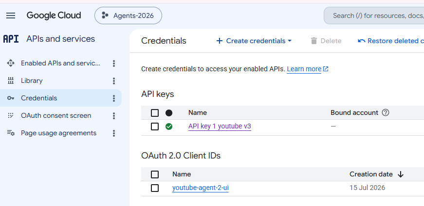

# GCP - YouTube API
- https://console.cloud.google.com/apis/library/youtube.googleapis.com?project=agents-2026-502600
- Enable API | https://developers.google.com/youtube/v3/docs/?apix=true
- Set up credential

## Steps
- Navigation menu → APIs & Services → Library.
- Search for “YouTube Data API v3” → Enable.
- APIs & Services → OAuth consent screen.
- Choose “Internal” (G Suite only) or “External” (most apps use External).
- Create OAuth 2.0 Client ID
    - APIs & Services → Credentials → + Create Credentials → OAuth client ID.
    - Application type: choose “Web application”.
    - Name: e.g., “youtube-learning-ui”.
    - Authorized JavaScript origins: `http://localhost:5173` and the Render UI origin.
    - No backend redirect URI or Google client secret is used. The UI uses Google Identity Services token flow and keeps the access token in memory.
