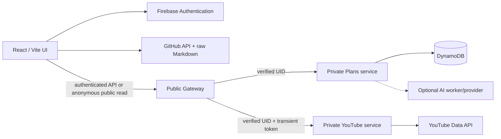

# YouTube Learning Workspace

A system-design proof of concept that turns YouTube sources and public GitHub notes into structured, searchable learning experiences.

[Open the live application](https://youtube-learning-ui.onrender.com/) · [Browse the implementation](../../../../src/y2026/youtube_agent_2) · [Start the system-design showcase](11_system-design-showcase.md)

## What it demonstrates

- Private learning plans organized as **plan → course → module → video**.
- Responsive video workspace with progress, playback restoration, labels, bookmarks, search, and navigation.
- Anonymous, read-only publication of selected learning plans.
- Public GitHub Markdown notes with repository/year/topic navigation, Mermaid, link previews, and local-development mode.
- Firebase identity with per-user data isolation.
- Offline-tolerant private-plan caching and bulk progress synchronization.
- YouTube channel, playlist, video, and incremental source-feed discovery.
- Manual and AI-assisted curriculum organization.
- Gateway, Plans, and YouTube service boundaries with AWS Lambda and DynamoDB deployment support.
- Mobile-first layouts and user-configurable appearance modes.

## Architecture at a glance

Only the gateway is publicly exposed. The browser reads public GitHub notes directly because those repositories require neither application authorization nor a secret. Private plan data always flows through the authenticated gateway.

## Recommended reading paths

### System-design interview

1. [System Design Showcase](11_system-design-showcase.md)
2. [Functional Requirements](12_functional-requirements.md)
3. [Non-Functional Requirements](13_non-functional-requirements.md)
4. [High-Level Design](14_high-level-design.md)
5. [Low-Level Design](15_low-level-design.md)
6. [Engineering Challenges and Tradeoffs](16_engineering-challenges-and-tradeoffs.md)
7. [Future Improvements](17_future-improvements.md)
8. [Interview and Demo Guide](18_interview-and-demo-guide.md)

### Implementation evolution

1. [Project Requirements](01_project-req-doc.md)
2. [Firebase Integration](02_firebase-integration.md)
3. [YouTube API Setup](03_youtube_api_enable.md)
4. [Microservice Architecture](04_microservices.md)
5. [LangGraph Exploration](05_langraph.md)
6. [Source Feed Inbox](06_source_feed_inbox.md)
7. [Persistent AI Job Queue](07_persistentAI_job_queue.md)
8. [Mobile-First UI](08_Mobile-first-ui.md)
9. [AWS Migration](09_aws-migration.md)
10. [Public Read Mode](10_read_mode.md)

The earlier implementation documents capture the project's evolution. Where an older approach was superseded—for example, persistent server-side YouTube OAuth versus a transient browser-memory token—the later document identifies the current decision.

## Core design decisions

| Decision | Reason | Accepted tradeoff |
| --- | --- | --- |
| Gateway is the only public backend | Central authentication, routing, throttling, and public-method policy | Additional request hop |
| Decomposed DynamoDB hierarchy | Bounded writes and avoidance of the 400 KB item limit | Aggregate reconstruction complexity |
| Redux plus per-user IndexedDB | Immediate UI response and offline continuity | Cache migration and reconciliation |
| Bulk progress merge | Coalesced, retryable, idempotent synchronization | No exact playback event history |
| Allow-listed public projection | Private fields remain private by default | Projection maintenance |
| Direct GitHub note reads | Low cost and no unnecessary backend dependency | External availability and anonymous rate limits |
| YouTube token held in memory | Reduces persistent-token exposure | No unattended synchronization after the browser closes |
| Durable AI request model | Handles latency, retries, and provider throttling | More workflow state and operational complexity |

## Suggested presentation flow

For a short showcase:

1. Explain the unstructured-learning problem.
2. Present the architecture diagram and service boundaries.
3. Deep-dive into offline progress synchronization.
4. Explain safe anonymous publication.
5. Discuss DynamoDB decomposition and its limits.
6. Demonstrate private course learning, public read mode, and GitHub notes.
7. Close with concurrency control, observability, public read models, and durable AI work as the next priorities.

The complete 10-minute and 30-minute scripts are in the [Interview and Demo Guide](18_interview-and-demo-guide.md).

## Scope note

This is a feature-rich POC, not a claim of internet-scale production maturity. Proposed scale numbers and service objectives are labelled as design targets, while invented presentation scenarios are explicitly labelled illustrative. The implementation has clear evolution points but still needs load testing, optimistic concurrency, stronger observability, security automation, and broader end-to-end coverage before large-scale production use.

