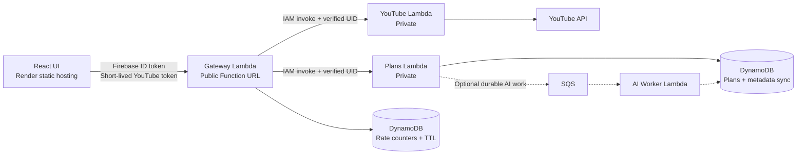

# AWS migration

Keep the React/Vite static UI on Render because static hosting remains available during inactivity. Move the APIs and application persistence to AWS.

## Architecture



## Decisions

- Keep `youtube-learning-ui` on Render static hosting.
- Deploy Gateway, YouTube, and Plans as three Lambda container functions.
- Expose only Gateway through a public Lambda Function URL.
- Give Gateway IAM permission to invoke the private YouTube and Plans functions.
- Replace PostgreSQL/Neon with DynamoDB for learning plans and metadata sync.
- Do not persist Firebase ID tokens, YouTube access tokens, or refresh tokens server-side.

## Security and tokens

The Gateway Function URL uses `AuthType: NONE`, so it is publicly callable before application authentication. Gateway must:

- Accept requests only from the exact Render UI origin through strict CORS. CORS is not authentication.
- Require and verify the Firebase ID token with Firebase Admin on every protected request.
- Derive the UID from the verified token; never trust a client-provided UID.
- Pass the verified UID to private Lambdas and reject arbitrary internal identity headers.
- Restrict body size and content type and never log authorization headers or tokens.

Let Firebase SDK manage browser session persistence and obtain ID tokens with `getIdToken()`. Do not copy tokens into local storage or persisted Redux state.

Use Google Identity Services for YouTube authorization:

- Keep the short-lived YouTube access token in JavaScript memory only.
- Request minimum scopes and reacquire a token through a user action after expiry.
- Either call YouTube directly from the browser or pass the token transiently to YouTube Lambda.
- Browser-only authorization means metadata sync cannot run after the browser closes.

## Rate limiting

Lambda instances do not share memory, so an in-process counter is insufficient.

- Use Lambda reserved concurrency as a global safety ceiling.
- Use DynamoDB atomic counters such as `RATE#uid#minute`, with TTL, for per-user limits.
- Consider API Gateway HTTP API later if managed route throttling or WAF is required.

## DynamoDB model

Do not store a complete learning plan in one item; DynamoDB items are limited to 400 KB.

| PK | SK | Data |
|---|---|---|
| `USER#uid` | `PLAN#planId` | Plan |
| `USER#uid` | `PLAN#planId#COURSE#courseId` | Course |
| `USER#uid` | `PLAN#planId#MODULE#moduleId` | Module |
| `USER#uid` | `PLAN#planId#VIDEO#videoId` | Video and playback state |
| `USER#uid` | `SYNC#CHANNEL#channelId` | Channel checkpoint |
| `USER#uid` | `SYNC#PLAYLIST#playlistId` | Playlist checkpoint |
| `USER#uid` | `FEED#channelId#videoId` | New feed item |

Use conditional writes with a `version` attribute to prevent lost updates.

## Lambda conversion

The current images start Uvicorn and cannot run on Lambda unchanged. Each service needs:

- An AWS Lambda Python base image.
- A Mangum ASGI adapter and Lambda handler as the container `CMD`.
- Temporary writes restricted to `/tmp`.
- Idempotent client retries for cold or inactive container starts; use provisioned concurrency only if immediate first-response latency becomes necessary.

## Estimated monthly cost

Assumptions: `us-west-2`, 30 days, no free-tier credits, 1,000 calls per day to each of the three Lambdas, 512 MB per function, and an average duration of one to two seconds. DynamoDB assumes 1,000 reads and 1,000 application writes per day, plus 1,000 Gateway rate-counter writes per day.

| Service | Monthly usage | Estimated cost |
|---|---:|---:|
| Render static UI | Within included bandwidth and build minutes | `$0.00` |
| Lambda requests | 90,000 invocations | `$0.02` |
| Lambda compute | 45,000-90,000 GB-seconds | `$0.75-$1.50` |
| DynamoDB requests | 30,000 reads + 60,000 writes | `< $0.05` |
| DynamoDB storage and PITR | About 1 GB | `$0.45` |
| ECR | About 3 GB of images | `$0.30` |
| SSM Parameter Store | Standard `SecureString` parameters | `$0.00` plus negligible KMS requests |
| CloudWatch | About 1 GB of logs | `$0.50-$1.00` |
| Data transfer | About 5 GB returned to browsers | `$0.45` |
| Lambda Function URL, IAM and TLS | No separate charge | `$0.00` |
| **Expected total** | Excluding optional AI processing | **`$3-$5/month`** |

Actual Lambda cost depends more on execution duration and memory than request count. YouTube synchronization and AI calls may run longer than ordinary plan operations. Do not enable provisioned concurrency for ten users unless cold-start latency becomes unacceptable.

Store server-side secrets in SSM Parameter Store Standard `SecureString` values under an environment-specific path. Lambda retrieves them at runtime using narrowly scoped IAM permissions. Secret values must not be committed to Terraform variables because Terraform state can retain them.

The estimate excludes Google/YouTube quota charges, LLM-provider charges, taxes, optional SQS/AI-worker usage, and Render bandwidth or build-minute overages. Pricing references: [Lambda](https://aws.amazon.com/lambda/pricing/), [DynamoDB](https://aws.amazon.com/dynamodb/pricing/), [ECR](https://aws.amazon.com/ecr/pricing/), and [Render static sites](https://render.com/docs/static-sites).

## AI jobs

The three-function design removes the persistent Plans worker. If durable AI generation remains, use:

```text
Plans Lambda -> SQS -> AI Worker Lambda -> DynamoDB job status
```

Lambda executions are limited to 15 minutes, so large AI requests must be divided into durable batches.
